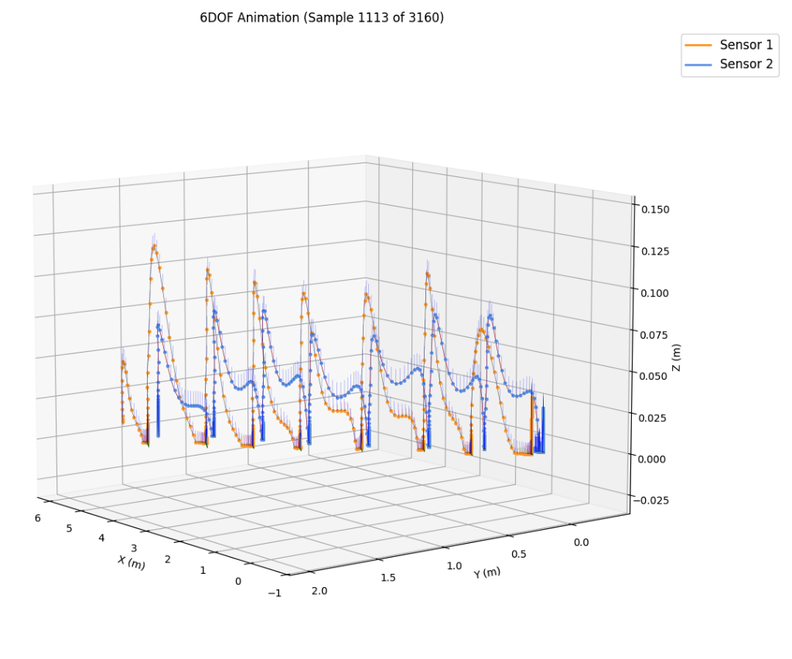
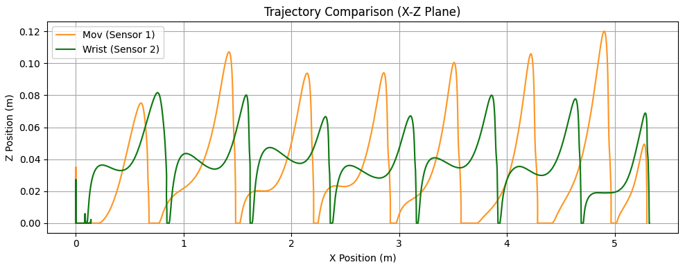
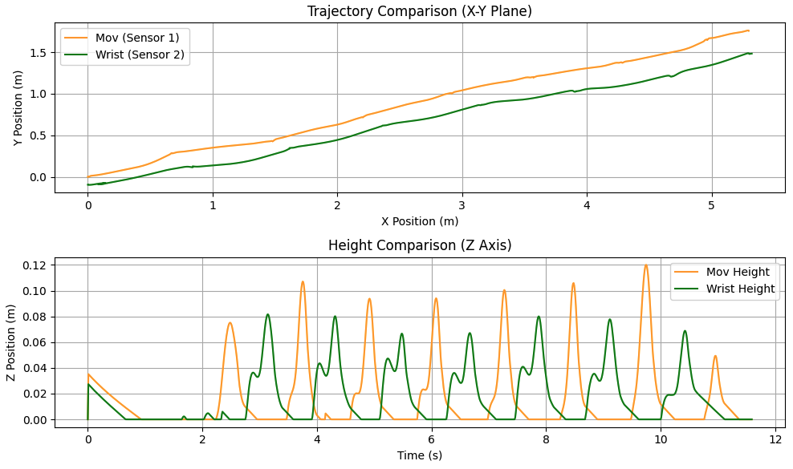
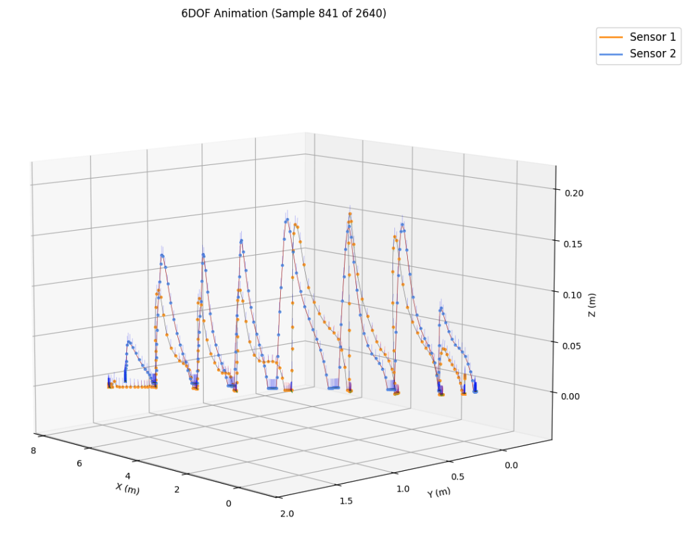
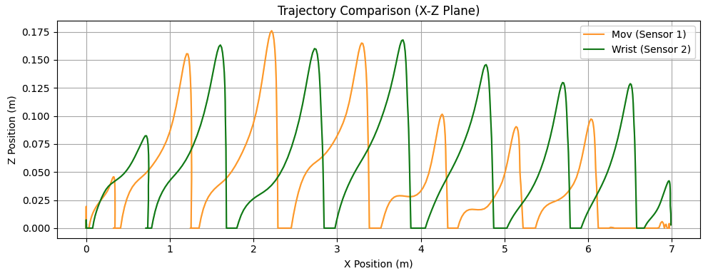
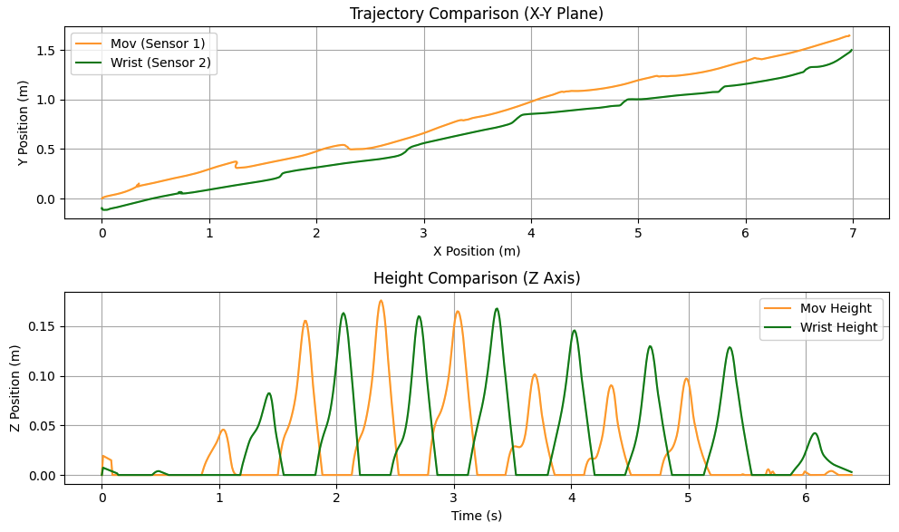
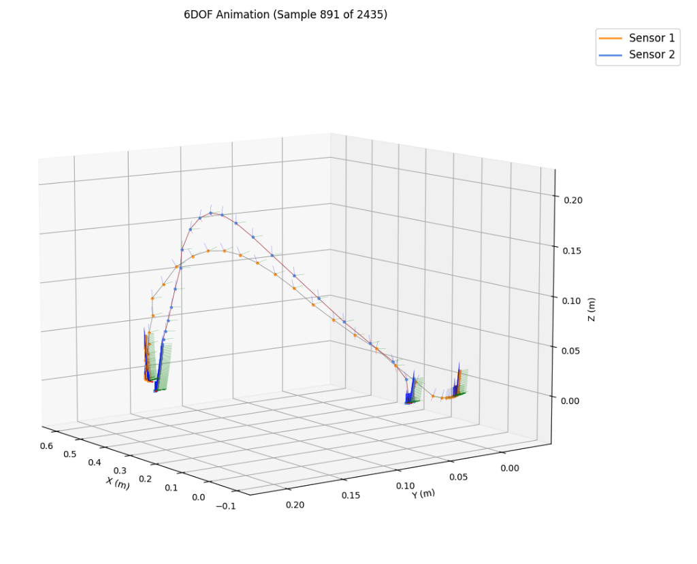
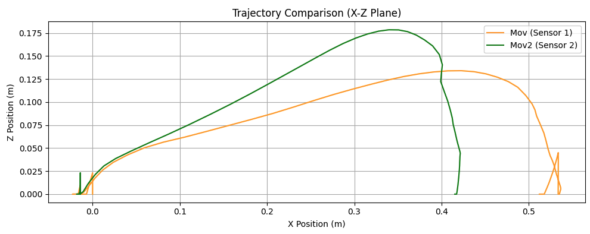
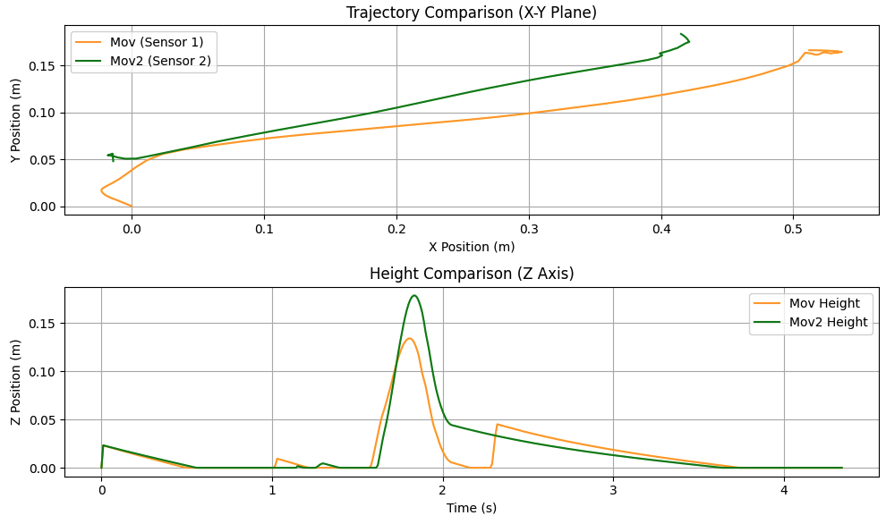

<div align="center">
  
  <h1>🏃‍♂️ Hibridación de Gait Tracking With x-IMU y Gaitmap (Two Sensors)</h1>
  <p><strong>Análisis y Reconstrucción de Trayectorias 3D con IMUs Duales</strong></p>

  <p>
    
    
    
    
    
    
    
  </p>
</div>

---

## ✨ Descripción General

El script principal **`ScriptTwoSensors.py`** es una herramienta desarrollada en Python para el procesamiento avanzado de datos inerciales provenientes de dos sensores **x-IMU** simultáneos. Está diseñado específicamente para analizar y reconstruir el movimiento del cuerpo en diferentes actividades deportivas y cotidianas.

**¿Qué es la Arquitectura de Hibridación?**
La innovación clave de este programa radica en su capacidad de comportarse como un "cerebro híbrido". No depende de una sola fórmula estricta, sino que selecciona dinámicamente la mejor metodología según lo que estés haciendo:
1. **Método Manual (Clásico):** Utiliza filtros AHRS (tipo Madgwick) con algoritmos de corrección *Detrending*. Es rápido, preciso e ideal para movimientos lentos, de baja aceleración o caminatas estándar.
2. **Método Probabilístico (Gaitmap):** Cuando saltas o corres a gran velocidad, el script cambia automáticamente su motor de cálculo a la librería *Gaitmap*, empleando potentes Filtros de Kalman (Estimadores de Estado RTS) y *RamppEventDetection* (modelos probabilísticos y estadísticos) para no perder el rastro de tus apoyos (ZUPT), incluso entre la vibración y el ruido violento del impacto en el asfalto.

¡Esta hibridación asegura que el pie nunca se hunda debajo del suelo y la pelvis coincida en la escala de desplazamiento sin importar si caminas, corres o saltas!

---

## 🚀 Características Principales

- 📡 **Doble Sensor Simultáneo:** Procesamiento sincronizado (típicamente ubicados en el pie derecho y en el pie izquierdo).
- 🧠 **Clasificador Automático de Actividad:** Detecta dinámicamente si el sujeto está realizando *Marcha*, *Correr* o realizando un *Salto* a través del análisis estadístico de la varianza y el pico de aceleración, aplicando reglas matemáticas diferentes para cada caso.
- ⚙️ **Hibridación Avanzada (Gaitmap Integrado):** Utiliza filtros RTS-Kalman y algoritmos de detección de apoyo *Zero Velocity Update (ZUPT)*, mitigando la deriva (*drift*) logarítmica/exponencial típica en la integración de acelerómetros a través de las funciones nativas y `RamppEventDetection`.
- 📐 **Alineación Geométrica y Retoque Z:** Rutinas PCA (Análisis de Componentes Principales) que detectan el vector de avance y un forzamiento de umbrales para asegurar matemáticamente que la altura `Z` nunca pase a ser negativa (se hunda en el suelo). Adicionalmente, empareja las escalas de tamaño al vuelo.
- 📊 **Visualización de Vanguardia:** Soporte nativo para visualizar señales Raw, Vistas de Múltiples Planos y Animaciones Cuaterniónicas Dinámicas.

---

## 🛠️ Prerrequisitos e Instalación

Asegúrate de contar con un entorno virtual y las dependencias Python requeridas instaladas.

```bash
# Recomendamos el uso de un entorno virtual
python -m venv env
source env/bin/activate  # (En macOS/Linux)
env\Scripts\activate     # (En Windows)

# Instalación de librerías requeridas
pip install numpy scipy pandas matplotlib gaitmap
```

> [!CAUTION]
> Es indispensable que las carpetas/módulos **`ximu_matlab_library`**, **`AHRS`** y **`Quaternions`** ya presentes en este repositorio se encuentren junto al script o en el `PYTHONPATH`, puesto que las rotaciones y funciones base dependen de ellas.

---

## 💻 ¿Cómo Usar este Script?

La configuración es rápida e intuitiva, controlada directamente en la cabecera del archivo.

1. Abre el archivo `ScriptTwoSensors.py` desde tu editor o IDE favorito.
2. Dirígete a la sección de configuración (alrededor de la **Línea 20**).
3. Ajusta la variable `filePath` con la ruta absoluta o relativa hacia tu captura de datos `.txt`:
   ```python
   filePath = 'ruta/hacia/dataset_de_captura.txt'
   ```
4. Delimita la ventana de análisis que te interese mediante las variables `startTime` y `stopTime`.
5. **Ejecuta** el script vía terminal:
   ```bash
   python "ScriptTwoSensors.py"
   ```

---

## 📉 Flujo de Operación

### 1️⃣ Importación y Detección
El script extrae inteligentemente la de la primera línea de tu archivo `.txt` la tasa de muestreo (Ej: `50Hz`, `100Hz` o frecuencias configuradas personalizadas). Une automágicamente IDs de sensores idénticos si fuesen necesarios.

### 2️⃣ Segmentación Estacionaria Base
Para la parte manual, usa un **Filtro Butterworth Pasa-Bajos/Altos** aislando ventanas estacionarias donde la variación se mantiene dentro de los rangos absolutos de $~1.0 g \pm 0.4 g$. 

### 3️⃣ Fusión y Proyección Z
Integración del cuaternión $q \rightarrow$ Rotación al modelo global $\rightarrow$ Cálculo aceleración sin la base de Gravedad (1g) $\rightarrow$ Integración para Velocidad y Posición, corrigiendo finalmente derivas del mundo real.

---

## 🗺️ Resultados y Análisis Gráfico

Para asegurar un estudio biomecánico completo, el procesamiento despliega una batería de ventanas gráficas separadas para cada etapa matemática. A continuación se detalla **cuidadosamente qué representa cada ventana** que aparecerá en tu pantalla:

### 📉 Paneles Físicos (Señales Crudas)
- **`Figure 1: Sensor 1 Data (Mov)`:** Muestra dos sub-gráficos en paralelo de los canales crudos de tu primer sensor. Arriba verás el **Giroscopio (deg/s)** y abajo el **Acelerómetro (G)**. Se añade un bloque "pulso negro" que resalta visualmente todos los instantes analizados como *fases estacionarias*.
- **`Figure 2: Sensor 2 Data (Mov2)`:** Exactamente igual a la Figura 1, pero desplegando el análisis para tu pie o sensor secundario.

### 📊 Paneles Matemáticos (Integración A-V-P)
Estas figuras traen paneles duales superpuestos (Arriba Sensor 1 / Abajo Sensor 2):
- **`Figure 3: Accelerations`:** Rastrea tu aceleración lineal convertida al marco global en `m/s²`, demostrando la resta de la barrera de gravedad en sus 3 ejes (X, Y, Z).
- **`Figure 4: Velocity`:** Muestra la velocidad transicional `m/s` de tus sensores. Aquí observarás la magia real del *ZUPT*: la línea de velocidad del pie colapsará fuertemente a 0 cada vez que tocas el suelo.
- **`Figure 5: Position`:** Visualiza la progresión de posición absoluta en métrica (m), detallando de forma matemática cuánto has avanzado, lado a lado.

### 🗺️ Paneles Topográficos (Comparaciones Directas Analíticas)
- **`Figure 6: Position Comparison`:** Panel principal de superposición. Su gráfica superior ("X-Y Plane") otorga tu **Vista Cenital** (vista desde un dron) ilustrando las desviaciones laterales de tu rumbo. Su gráfica inferior ("Z Axis") compara exclusivamente las alturas, mostrando la elevación del pie vs salto de la pelvis.
- **`Figure 7: Y vs Z View`:** Muestra las trayectorias estrictamente enfocadas en el Plano **Frontal/Coronal**. Muy útil para detectar asimetrías mediales/laterales en cada brinco o paso.
- **`Figure 8: X vs Z View`:** Revela la topografía en el Plano **Sagital** (visto de lado de perfil). Ideal para inspeccionar la longitud y elevación exacta de tus zancadas sin ruido lateral.

### 🎥 Animación 3D y Visualización 6-DOF (`SixDofAnimationTwoSensors.py`)
¡La joya de la corona! Una renderización final interactiva que levanta un simulador completamente tridimensional en donde interaccionarás con:
- **⌚ Evolución Temporal en Vivo:** Tus sensores viajan por la cuadrícula 3D de manera sincronizada y proporcional al tiempo que tomó el ejercicio `(t)`. 
- **🌐 Malla y Rotación Panorámica:** Un suelo virtual cuadriculado que rotará automáticamente y suavemente su cámara virtual ( `$Spin = 120` grados por trayecto) permitiéndote apreciar la biomécánica sin que toques ni un botón de giro.
- **〰️ Rastros Brillantes (Trails):** Mientras los sensores ("cuadrados flotantes") se mueven, van derramando una tinta mágica en el aire trazando la ruta continua y exacta del pie y tu cadera volumétricamente.
- **🧭 Apuntado Cuaterniónico Completo (Vectores R-G-B):** Ambos sensores manifiestan dinámicamente sólidas flechas que apuntan hacia sus planos cardinales correspondientes. Cambian maravillosamente según transites para revelar matemáticamente, dentro del render 3D, tu inclinación o ladeo verdadero (Pitch, Roll, Yaw).

---

## 🏆 Caso de Estudio: Marcha a 100 Hz

### Análisis Cuantitativo: Marcha 5 m (100 Hz)
Se analizaron las gráficas de trayectoria (Planos X-Y, X-Z y Z-Time) para una marcha estándar. La distancia total proyectada en el eje de avance (X) fue de aproximadamente 5.3 metros.

<div align="center">
  
</div>

### 3.1.1 Conteo de zancadas

| Sensor | Sesión / Actividad | Conteo detectado | Distancia total (X) |
| :--- | :--- | :--- | :--- |
| **Sensor 1 (Mov)** | Marcha 5m | 8 pasos | ~5.3 m |
| **Sensor 2 (Wrist - Mov2)** | Marcha 5m | 7 pasos | ~5.3 m |

### 3.1.2 Métricas espaciales por zancada

| Indicador | Sensor 1 (Mov) | Sensor 2 (Mov2 o Wrist) |
| :--- | :--- | :--- |
| **Longitud media** | 0.66 m | 0.75 m |
| **Altura media (Clearance)** | 0.095 m | 0.074 m |
| **Altura máxima alcanzada** | 0.120 m | 0.082 m |
| **Base de apoyo (Z=0)** | Estable (0.000 m) | Estable (0.000 m) |

<br>

<div align="center">
  
  <br><br>
  
</div>

### 3.1.3 Interpretación técnica
Comportamiento validado del pipeline en base a los datos tabulados:
- **ZUPT efectivo**: La velocidad del pie colapsa a $0$ estrictamente en cada fase de apoyo, lo que se refleja en las mesetas sostenidas de $0.000\text{ m}$ en el eje Z.
- **Proporción anatómica lógica**: Un franqueo (*clearance*) medio de $0.074\text{ m}$ para el pie y una longitud de zancada de $0.75\text{ m}$ son métricas fisiológicamente coherentes para un sujeto adulto, confirmando que la escala de doble integración es correcta.
- **Control de Deriva (Drift)**: La desviación lateral máxima en el plano X-Y se contuvo en $~1.5\text{ m}$ (comportamiento natural de marcha no guiada), y la regla `np.maximum` impidió exitosamente que las alturas tomaran valores negativos en el eje Z.
- **Cinemática 3D**: El renderizado 6-DOF estima correctamente la actitud continua (Pitch/Roll/Yaw) sin pérdida de referencia espacial.

---

### Análisis Cuantitativo: Carrera 7 m (100 Hz)
Se analizaron las gráficas de trayectoria para la prueba catalogada como carrera. La proyección en el eje de avance (X) indica un recorrido real capturado de aproximadamente 7.0 metros.

<div align="center">
  
</div>

### 3.2.1 Conteo de zancadas

| Sensor | Sesión / Actividad | Conteo detectado | Distancia total (X) |
| :--- | :--- | :--- | :--- |
| **Sensor 1 (Mov)** | Carrera | 7 zancadas | ~7.0 m |
| **Sensor 2 (Wrist - Mov2)** | Carrera | 8 zancadas | ~7.0 m |

### 3.2.2 Métricas espaciales por zancada

| Indicador | Sensor 1 (Mov) | Sensor 2 (Mov2 o Wrist) |
| :--- | :--- | :--- |
| **Longitud media** | ~1.00 m | ~0.87 m |
| **Altura media (Clearance)** | ~0.120 m | ~0.130 m |
| **Altura máxima alcanzada** | 0.175 m | 0.170 m |
| **Tiempo de apoyo (Z=0)** | Reducido (típico de carrera) | Breve pero estable en 0.000 m |

<br>

<div align="center">
  
  <br><br>
  
</div>

### 3.2.3 Interpretación técnica
Comportamiento validado del pipeline bajo condiciones de alto impacto:
- **ZUPT bajo vibración extrema**: A diferencia de la marcha, las mesetas en $Z=0.000\text{ m}$ son significativamente más cortas. Esto refleja correctamente la reducción del tiempo de la fase de apoyo (*stance*) en la biomecánica de la carrera. El umbral elevado del algoritmo toleró el ruido del impacto sin perder el enganche al suelo.
- **Cinemática de fase de vuelo**: Las alturas máximas se elevan drásticamente (hasta $17.5\text{ cm}$) en comparación con la marcha, evidenciando la "fase de vuelo" característica de la carrera donde ambos pies (o el centro de masa) alcanzan un pico parabólico pronunciado.
- **Estabilidad del eje Z**: A pesar de la violencia del movimiento, la restricción `np.maximum` sigue funcionando perfectamente; la gráfica demuestra que el pie no "perfora" el suelo tras las caídas aceleradas de cada zancada.
- **Proporciones inter-sensores**: La hibridación logró un escalado coherente. Las alturas y el avance del sensor de la pelvis responden de manera proporcional a los impactos del pie, manteniendo la sincronía en el modelo 3D sin que un sensor se desplace artificialmente más rápido que el otro.

---

### Análisis Cuantitativo: Salto (100 Hz)
Se analizaron las gráficas de trayectoria para un evento balístico singular (un salto hacia adelante). La distancia proyectada confirma un desplazamiento neto cercano a los 40 cm.

<div align="center">
  
</div>

### 3.3.1 Conteo de zancadas

| Sensor | Sesión / Actividad | Conteo detectado | Distancia total (X) |
| :--- | :--- | :--- | :--- |
| **Sensor 1 (Mov)** | Salto Horizontal | 1 fase de vuelo | ~0.53 m |
| **Sensor 2 (Wrist - Mov2)** | Salto Horizontal | 1 fase de vuelo | ~0.42 m |

### 3.3.2 Métricas espaciales del salto

| Indicador | Sensor 1 (Mov) | Sensor 2 (Mov2 o Wrist) |
| :--- | :--- | :--- |
| **Desplazamiento horizontal neto** | 0.53 m | 0.42 m |
| **Altura máxima alcanzada (Z)** | 0.135 m | 0.175 m |
| **Tiempo de vuelo (aprox)** | ~0.4 s | ~0.4 s |
| **Comportamiento post-impacto** | Estabilizado en Z=0 | Estabilizado en Z=0 |

<br>

<div align="center">
  
  <br><br>
  
</div>

### 3.3.3 Interpretación técnica
Comportamiento validado del pipeline bajo dinámica de salto:
- **Fase de vuelo balística**: La gráfica X-Z muestra una parábola limpia y continua. Al no haber apoyo durante el vuelo, el sistema de hibridación confía plenamente en la estimación del filtro RTS-Kalman, logrando reconstruir el arco del salto sin cortes artificiales.
- **Tolerancia extrema al impacto**: El aterrizaje de un salto horizontal genera el pico de aceleración más violento. Las gráficas de altura (Z vs Time) muestran que la línea colapsa de forma controlada hacia la base ($0.000\text{ m}$) y se mantiene plana tras el impacto. El ZUPT absorbió el choque sin generar un rebote matemático.
- **Precisión espacial (Ground Truth)**: La convergencia de la trayectoria del pie (Sensor 2) en $~0.42\text{ m}$ en el eje X demuestra una alta fidelidad métrica del algoritmo para capturar desplazamientos cortos y explosivos.
- **Cinemática 3D**: El render 6-DOF evidencia la inclinación del pie durante el despegue y el aterrizaje, validando que el cálculo del cuaternión soporta rotaciones agresivas en el aire.

---

## 💡 Consejos de Optimización

> [!TIP]
> **Carreras con alto impacto:** Si vas a analizar trayectorias de *running*, ten en cuenta que el estimador interno eleva su `inactive_signal_threshold` artificialmente para ignorar vibraciones extremas del zapato. En caso de trayectos irregulares con este modo, puedes ajustar ese número en el condicional para correr dentro de las lógicas de ZUPT.

---
<div align="center">
<i>Desarrollado y optimizado para una fácil asimilación del pipeline de tracking Biomecánico.</i><br>
<sub>Hecho con Python 🐍</sub>
</div>
